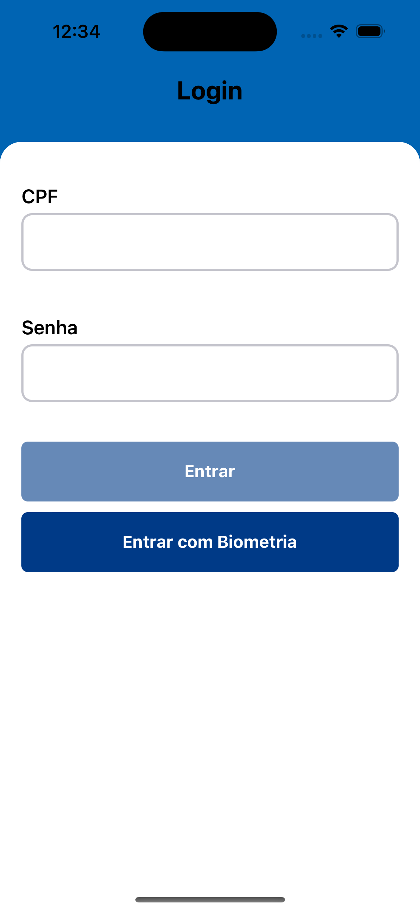
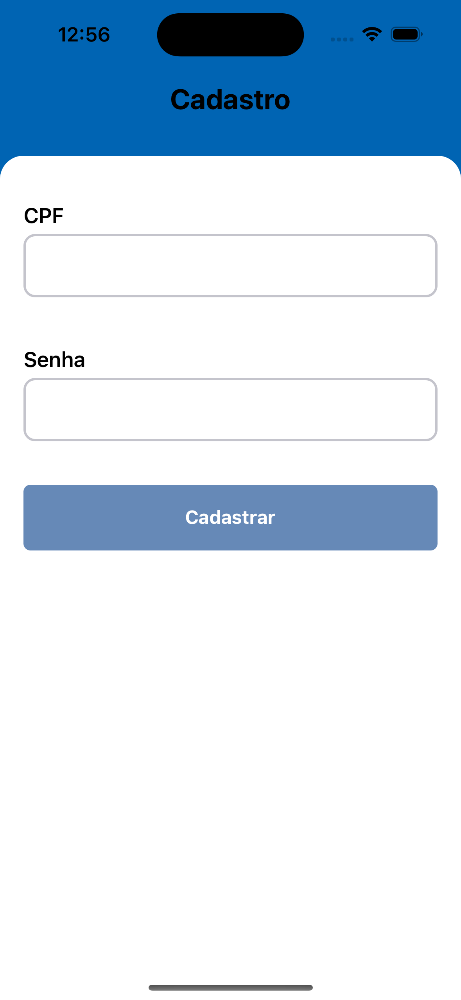
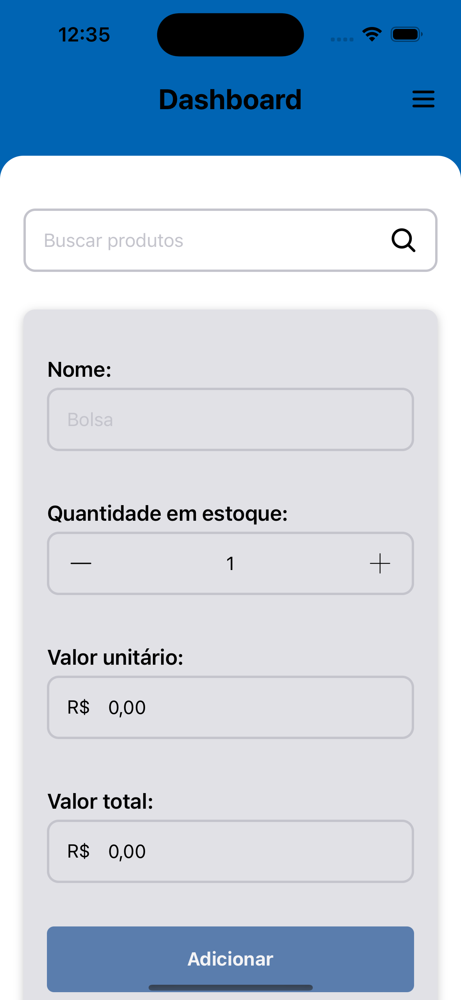
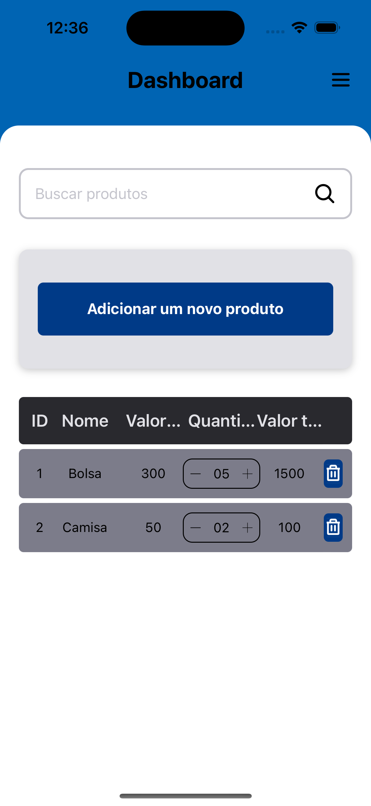
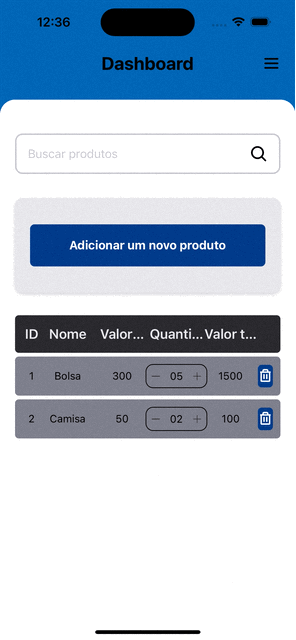
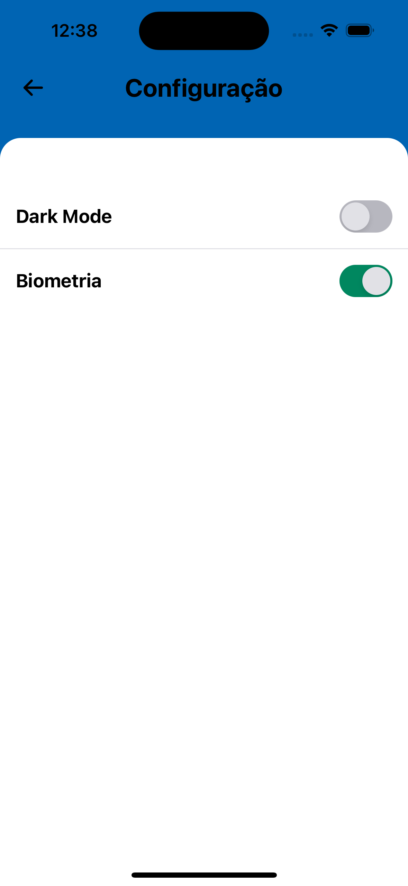

# Desafio: Produtos App (Empresa: Cumbuca)

## Tecnologias usadas

- React Native
- Expo
- Jest
- Asyncstorage
- React Native Reanimated
- Typescript

## Escolhas Técnicas

### Desafio

Para atender a esse desafio, optei por utilizar o Expo Managed Workflow, que oferece diversas ferramentas e recursos integrados para o desenvolvimento de aplicações React Native. Adicionalmente, realizei uma implementação simplificada da navegação e do formulário, sem a necessidade de instalar e configurar bibliotecas adicionais.

### Detalhes da Implementação

#### Navegação

- Foi disponibilizado, através do contexto da aplicação, um hook (useNavigation) que fornece duas funções principais: a função navigate para navegar para outras telas e a função goBack para voltar à tela anterior.
- O roteamento das telas foi feito através de um arquivo de configuração centralizado na raiz de cada módulo, facilitando a manutenção e a adição de novas telas no futuro, tornando o código mais organizado e modular.

#### Formulário

- O hook useForm está disponível e fornece os recursos necessários para criar e gerenciar formulários, como validação de campos, envio de dados e controle de erros.
- Para validar os campos CPF e outros campos com regex, foram criadas duas funções auxiliares: a função validateCPF para validar o CPF do usuário e a função validateRegex para validar outros campos usando expressões regulares.

### Funcionalidades

- [x] Cadastro no primeiro acesso.
- [x] Login.
- [x] Adicionar produto.
- [x] Listagem de produtos.
- [x] Permitir alterar a ordem da lista.
- [x] Ordenação da lista com base no cabeçalho.
- [x] Ativar/desativar biometria.
- [x] DarkMode/LightMode.

## Configuração

```shell
git clone https://github.com/rogertavaress/cumbuca-challenge.git
cd cumbuca-challenge
yarn
```

## Execução

```shell
yarn start -c
```

## Testes

### Testes Unitários

```shell
yarn test:unit
```

Todos os testes unitários podem ser encontrados na pasta do proprio componente. (ex: MyCustomComponent.test.tsx)

### Testes E2E

```shell
yarn test:e2e:start
yarn test:e2e:config
yarn test:e2e:build

yarn test:e2e
```

Todos os testes E2E podem ser encontrados na pasta "./e2e".

## Telas

### Login



### Cadastro



### Dashboard




### Dashboard - Animação da lista



### Settings


